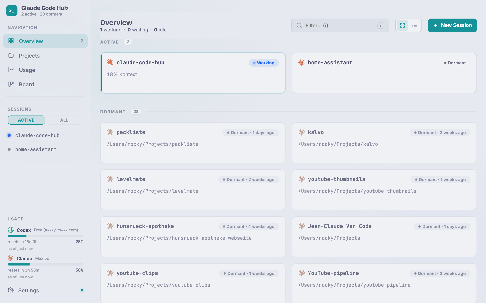

# Claude Code Hub

Web-Interface zum Verwalten und Fernsteuern von Claude Code Sessions auf deinem Mac mini —
erreichbar per Browser, auch vom iPhone aus.



---

## Was macht das?

Claude Code Hub ist ein kleiner Server, der auf deinem Mac mini läuft. Er zeigt dir alle laufenden Claude Code Sessions in einem Dashboard und lässt dich per Browser ins Terminal einsteigen — von deinem Mac, iPad oder iPhone aus, auch über das Internet.

**Features:**
- Dashboard mit allen Sessions und Live-Status (Aktivität, Context-Tokens, 5h-Limit)
- Terminal im Browser (vollständig, mit Farben, Shift/Alt+Drag zum Kopieren)
- Sessions starten, verbinden, beenden, umbenennen
- **Bulk-Aktion**: alle idle/unattached Sessions auf einen Klick beenden
- **Pinning** für wichtige Sessions (sortiert oben auf dem Dashboard)
- **Git-Status** pro Session-Card (Branch, dirty-Dot, ↑n/↓n Ahead/Behind)
- Projekt-Verwaltung mit Roadmap-Ansicht und Version-abschließen-Flow
- Usage-Tracking (Kosten, Token, 5h-Limit)
- Notifications über Sound, Visual, Web-Push und Per-Session-Mute
- PWA — als App auf dem iPhone-Homescreen installierbar, nativer iOS-Feel
- Auto-Start nach Reboot via macOS LaunchAgent
- **Security**: Bearer-Token-Auth, optional Cloudflare Access (Zero Trust) davor, Rate-Limiting auf REST-Endpoints, Append-only Audit-Log (`~/.claude-code-hub/audit.log`)

---

## Voraussetzungen

Du brauchst diese Programme auf deinem Mac mini, bevor du anfängst:

### 1. Xcode Command Line Tools

Öffne das Terminal (Programme → Dienstprogramme → Terminal) und tippe:

```bash
xcode-select --install
```

Ein Fenster öffnet sich — auf „Installieren" klicken und warten (ca. 5 Minuten).

### 2. Homebrew

Homebrew ist ein Paketmanager für macOS. Installiere ihn mit:

```bash
/bin/bash -c "$(curl -fsSL https://raw.githubusercontent.com/Homebrew/install/HEAD/install.sh)"
```

Nach der Installation erscheint am Ende eine Meldung wie:

```
==> Next steps:
    Run these commands in your terminal:
    echo 'eval "$(/opt/homebrew/bin/brew shellenv)"' >> ~/.zprofile
    eval "$(/opt/homebrew/bin/brew shellenv)"
```

Diese zwei Zeilen genau so ausführen (copy-paste).

Prüfe ob es funktioniert hat:

```bash
brew --version
# sollte ausgeben: Homebrew 4.x.x
```

### 3. Node.js

```bash
brew install node
node --version
# sollte ausgeben: v20.x.x oder neuer
```

### 4. Claude Code CLI

Das ist die eigentliche Claude-Kommandozeile, die der Hub verwaltet:

```bash
npm install -g @anthropic-ai/claude-code
claude --version
```

Falls `claude` nach der Installation nicht gefunden wird:

```bash
export PATH="$HOME/.local/bin:$PATH"
# Diese Zeile auch in ~/.zprofile eintragen damit sie nach Neustart bleibt:
echo 'export PATH="$HOME/.local/bin:$PATH"' >> ~/.zprofile
```

Dann einmalig `claude` starten und den Anweisungen folgen (Anthropic-Account verbinden).

---

## Installation

### Repo herunterladen

```bash
cd ~
git clone https://github.com/DerRemo/claude-code-hub.git
cd claude-code-hub
```

### Setup ausführen

```bash
chmod +x setup.sh
./setup.sh
```

Das Script macht alles automatisch:

1. Prüft ob Node.js und tmux vorhanden sind (installiert tmux falls nötig)
2. Installiert die npm-Abhängigkeiten
3. Erstellt eine `.env`-Datei mit einem zufälligen Auth-Token
4. Richtet einen LaunchAgent ein (Server startet automatisch nach Reboot)
5. Startet den Server

Am Ende siehst du so etwas:

```
  ✓ Claude Code Hub läuft!

  Lokal:   http://localhost:3333
```

> **Wichtig:** Das Setup zeigt dir einmalig dein Auth-Token. Notiere es — du brauchst es für den Browser-Zugriff. Du kannst es jederzeit wieder nachschauen mit:
> ```bash
> grep AUTH_TOKEN claude-code-hub/.env
> ```

---

## Erster Zugriff

Öffne im Browser auf demselben Mac:

```
http://localhost:3333
```

Beim ersten Besuch fragt der Browser nach dem Token — das ist der Wert aus `AUTH_TOKEN` in deiner `.env`. Nach einmaliger Eingabe wird er im Browser gespeichert.

---

## Remote-Zugriff über Cloudflare Tunnel (optional)

Wenn du den Hub auch von außerhalb deines Heimnetzwerks erreichen willst (iPhone unterwegs, anderer Rechner), kannst du Cloudflare Tunnel einrichten. Das ist kostenlos.

### Cloudflare-Account und Domain

Du brauchst einen kostenlosen Account auf [cloudflare.com](https://cloudflare.com) und eine Domain, die du dort verwaltest. Eine `.xyz`-Domain kostet ca. 1 €/Jahr.

### cloudflared installieren

```bash
brew install cloudflared
```

### Tunnel erstellen

```bash
cloudflared tunnel login
cloudflared tunnel create claude-hub
```

Der zweite Befehl gibt eine Tunnel-ID aus (sieht so aus: `abc123de-...`). Notiere sie.

### DNS-Eintrag anlegen

```bash
cloudflared tunnel route dns claude-hub code.DEINE-DOMAIN.xyz
```

### Tunnel-Konfiguration

Erstelle die Datei `~/.cloudflared/config.yml`:

```bash
mkdir -p ~/.cloudflared
nano ~/.cloudflared/config.yml
```

Inhalt (ersetze `TUNNEL-ID` und `DEINE-DOMAIN.xyz`):

```yaml
tunnel: TUNNEL-ID
credentials-file: /Users/DEIN-USERNAME/.cloudflared/TUNNEL-ID.json

ingress:
  - hostname: code.DEINE-DOMAIN.xyz
    service: http://localhost:3333
  - service: http_status:404
```

Speichern mit `Ctrl+O`, `Enter`, `Ctrl+X`.

### Tunnel als LaunchAgent einrichten

```bash
cloudflared service install
launchctl start com.cloudflare.cloudflared
```

Ab jetzt ist der Hub unter `https://code.DEINE-DOMAIN.xyz` erreichbar.

---

## Remote-Zugriff zusätzlich mit Cloudflare Access härten (empfohlen)

Der Cloudflare Tunnel macht deinen Hub öffentlich erreichbar. Die einzige Auth-Schicht ist in diesem Zustand der statische Bearer-Token in `.env`. Wenn du dein Setup enger schrauben willst, schalte **Cloudflare Access (Zero Trust)** davor — dann muss sich jeder Browser-Besucher vor dem Hub erst bei Cloudflare via GitHub, Google, Email-PIN oder einer anderen Identity-Lösung anmelden. Cloudflare signiert die Identität als JWT, der Hub verifiziert die Signatur, und **nur** Requests mit gültigem JWT **und** gültigem Bearer kommen durch. Localhost-Traffic (z.B. Claude-Code-Hooks auf dem Mac mini selbst) ist davon nicht betroffen — der läuft weiter nur über Bearer, weil er den Tunnel nicht passiert.

### Voraussetzungen

- Cloudflare Tunnel läuft schon (siehe oben)
- Zero Trust ist im Cloudflare-Account aktiviert (kostenlos für Privat-Nutzung, [Setup hier](https://one.dash.cloudflare.com/))

### Access-Application anlegen

1. **Zero Trust Dashboard** öffnen → **Access → Applications → Add an application → Self-hosted**.
2. **Application name:** `Claude Code Hub` (frei wählbar).
3. **Session Duration:** `24 hours` (oder länger, je nach Geschmack).
4. **Application domain:** deine Tunnel-Domain (z.B. `code.DEINE-DOMAIN.xyz`).
5. Als **Identity Provider** mindestens einen aktivieren (in den Team-Settings vorher einrichten):
   - **GitHub OAuth** (ein Klick, wenn du eh GitHub nutzt)
   - **One-Time-PIN per Email** (keine OAuth-App nötig, Code wird an deine Email gesendet)
6. **Policy anlegen:** `Action = Allow`, Include = eine oder beide Regeln:
   - `Emails` → deine Email-Adresse (für den PIN-Pfad)
   - `GitHub` → dein GitHub-Username (für den GitHub-OAuth-Pfad)
7. Application speichern.
8. In der Application-Overview den **Application Audience (AUD) Tag** kopieren — ein 64-Zeichen Hex-String.

### Hub konfigurieren

`claude-code-hub/.env` editieren und beide Variablen setzen:

```bash
CF_ACCESS_TEAM_DOMAIN=deinteam.cloudflareaccess.com
CF_ACCESS_AUD=3c994b6913e0ee914f118337173aabdaa7a54a7c82f98e6f2b93b57fa7078db5
```

Die `TEAM_DOMAIN` findest du im Zero-Trust-Dashboard oben links (ohne `https://`). Der `AUD` ist der Tag aus Schritt 8.

Dann Hub neu starten:

```bash
launchctl kickstart -k gui/$(id -u)/com.claude-code-hub
```

### Testen

1. Im Browser auf `https://code.DEINE-DOMAIN.xyz` → du wirst auf eine Cloudflare-Login-Seite umgeleitet, wählst GitHub oder Email-PIN, authentifizierst dich, und landest dann im Hub-Dashboard.
2. Prüfe das Audit-Log:
   ```bash
   tail -1 ~/.claude-code-hub/audit.log
   ```
   Du solltest einen `auth.login`-Eintrag mit deiner Email-Adresse sehen.

### Rollback falls was schief geht

Einfach `.env` wieder leeren (`CF_ACCESS_TEAM_DOMAIN=` und `CF_ACCESS_AUD=`) und Hub neu starten. Dann läuft der Server wieder im Bearer-only-Modus. Kein Code-Rollback nötig — die Feature ist komplett Env-gated.

---

## Konfiguration

Alle Einstellungen stehen in `claude-code-hub/.env`:

| Variable | Standard | Beschreibung |
|---|---|---|
| `PORT` | `3333` | Port des Servers |
| `AUTH_TOKEN` | — | Pflichtfeld, wird von setup.sh generiert |
| `SESSION_PREFIX` | `cc-` | Prefix für neue Session-Namen |
| `DEFAULT_PROJECT_DIR` | `~` | Standard-Verzeichnis für neue Sessions |
| `TMUX_PATH` | auto-detected | Pfad zum tmux-Binary (wird automatisch via `which tmux` gefunden) |
| `PROJECT_ROOTS` | `~/Projects` | Verzeichnisse für die Projekt-Erkennung (kommagetrennt) |
| `BROWSE_ROOTS` | `$HOME` | Allow-List für den Verzeichnis-Picker im UI. `:`-getrennt, `~` erlaubt. Beispiel: `~/Projects:/Volumes/SSD/code` |
| `VAPID_PUBLIC_KEY` / `VAPID_PRIVATE_KEY` | auto | Web-Push-Keys, werden beim ersten Start erzeugt |
| `VAPID_SUBJECT` | — | Pflicht für Apple Web Push — echte HTTPS-Domain (kein localhost) |
| `CF_ACCESS_TEAM_DOMAIN` | — | Optional. Cloudflare-Zero-Trust-Team-Domain (z.B. `deinteam.cloudflareaccess.com`). Leer = Cloudflare-Access-JWT-Validation disabled |
| `CF_ACCESS_AUD` | — | Optional. Application-Audience-Tag aus dem Cloudflare-Dashboard. Beide `CF_ACCESS_*` Variablen müssen gesetzt sein damit JWT-Validation aktiv wird |

Nach Änderungen an `.env` muss der Server neu gestartet werden:

```bash
launchctl kickstart -k gui/$(id -u)/com.claude-code-hub
```

---

## Server verwalten

```bash
# Status prüfen
launchctl list | grep claude-code-hub

# Server neu starten (z.B. nach Code-Änderungen)
launchctl kickstart -k gui/$(id -u)/com.claude-code-hub

# Server stoppen
launchctl bootout gui/$(id -u) ~/Library/LaunchAgents/com.claude-code-hub.plist

# Logs live verfolgen
tail -f claude-code-hub/logs/stdout.log
tail -f claude-code-hub/logs/stderr.log

# Audit-Log (Auth-Events, Session-Lifecycle, Rate-Limits)
tail -f ~/.claude-code-hub/audit.log | jq -c
```

---

## Updates

```bash
cd claude-code-hub
git pull
npm install
launchctl kickstart -k gui/$(id -u)/com.claude-code-hub
```

---

## Fehlerbehebung

### „Port 3333 bereits belegt"

Ein anderer Prozess nutzt den Port. Prüfen und beenden:

```bash
lsof -i :3333
kill -9 <PID aus der Ausgabe>
```

### Hub startet nicht nach Reboot

LaunchAgent neu laden:

```bash
launchctl bootout gui/$(id -u) ~/Library/LaunchAgents/com.claude-code-hub.plist
launchctl bootstrap gui/$(id -u) ~/Library/LaunchAgents/com.claude-code-hub.plist
```

### `claude`-Befehl nicht gefunden im Terminal

```bash
echo 'export PATH="$HOME/.local/bin:/opt/homebrew/bin:$PATH"' >> ~/.zprofile
source ~/.zprofile
```

### Token vergessen

```bash
grep AUTH_TOKEN claude-code-hub/.env
```

### 401 seit Cloudflare Access aktiviert ist

Im Audit-Log schauen welcher Grund:

```bash
tail -20 ~/.claude-code-hub/audit.log | grep auth.fail | jq -c
```

- `reason: "bad-jwt:no-jwt"` → Browser ist nicht durch Cloudflare Access gegangen. Lösche die Cookies für `code.DEINE-DOMAIN.xyz` und lade neu, dann solltest du wieder den GitHub/PIN-Flow sehen.
- `reason: "bad-jwt:bad-aud"` → `CF_ACCESS_AUD` in `.env` stimmt nicht mit dem Audience-Tag der Access-Application überein. Nochmal im Cloudflare-Dashboard nachschauen.
- `reason: "bad-jwt:bad-iss"` → `CF_ACCESS_TEAM_DOMAIN` stimmt nicht. Muss exakt die Team-URL ohne `https://` sein.
- `reason: "bad-jwt:expired"` → JWT ist abgelaufen. Session-Duration im Access-Application-Setup hochdrehen.
- `reason: "bad-bearer"` → Bearer-Token im Browser stimmt nicht mit `AUTH_TOKEN` in `.env` überein. Alten Token vergessen lassen (`localStorage.removeItem('cchub_token')` in der DevTools-Console), dann lädt der Browser beim nächsten Request das Login-Prompt neu.

### Tmux-Socket fehlt

Einmalig eine tmux-Session starten damit der Socket angelegt wird:

```bash
tmux new-session -d -s init
```

---

## Stack

- **Backend:** Node.js + Express + express-ws + node-pty
- **Frontend:** Vanilla JS + xterm.js (kein Build-Step)
- **Sessions:** tmux
- **Remote:** Cloudflare Tunnel, optional Cloudflare Access (Zero Trust) davor
- **Security:** Bearer-Token + optional JWT-Validation (via `jose`) + Fixed-Window Rate-Limiting + JSONL Audit-Log
