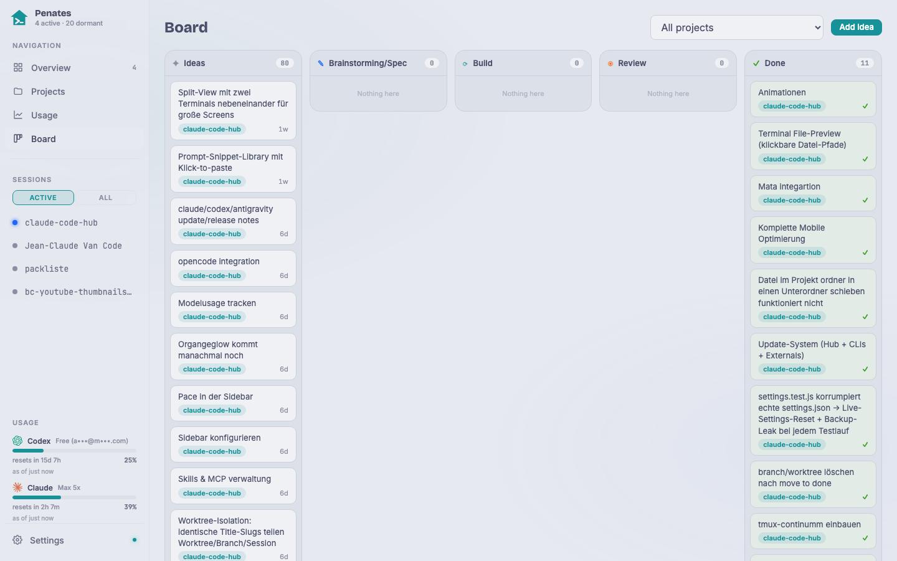

## Was es ist

Das Board ist ein globales Kanban-Board: eine Karte pro Idee, verfolgt durch sechs Stufen (`idea → brainstorming → spec → implement → review → done`). Die Stage-Keys sind stabiles Englisch; die UI-Labels sind lokalisiert. Alle Projektideen leben hier; das projektspezifische Dokument (`CHANGELOG.md`) deckt nur ab, was bereits shipped oder aktiv in Entwicklung ist.

## Warum / wann

Das Board führt eine Idee an einem einzigen Ort bis zur fertigen Arbeit. Karten können eigene Coding-Sessions spawnen, teils autonom, ohne den Hub zu verlassen. Die Review-Spalte zeigt den Live-Branch↔Base-Diff, damit die Arbeit vor dem Merge geprüft werden kann.

## Wie nutzen

- **Karte anlegen:** **+ Add idea** klicken, Titel vergeben, Projekt und Priorität im rechten Panel auswählen.
- **Karte verschieben:** Per Drag & Drop in die nächste Spalte ziehen, um die Stufe zu wechseln; auf Mobilgeräten alternativ das Stage-Dropdown im Detail-Panel nutzen.
- **Bearbeiten:** Das rechte Panel erlaubt Inline-Bearbeitung von Titel, Priorität und Stage. Löschen erfordert zwei Klicks.
- **Projektfilter:** Der Filter oben schränkt das Board auf ein Projekt ein.

**Autonome Pipeline-Phasen:**

- **Brainstorm:** *Brainstorm* auf einer `idea`-Karte startet eine Brainstorm-Session, die mit dem Kartentitel und dem Projektkontext geprimed wird.
- **Implement:** *Implement* legt einen isolierten git-Worktree auf einem `idea/<slug>`-Branch an und startet darin eine Coding-Session.
- **Review:** Die Review-Spalte zeigt den Branch↔Base-Diff direkt im Hub, ohne den Browser verlassen zu müssen.
- **Finish:** *Finish* auf einer `review`-Karte mergt den Branch, schreibt einen Changelog-Eintrag und pusht. Worktree und Branch werden automatisch bereinigt.

**Karte nach Done verschieben** (per Drag, Dropdown oder Finish) löst einen Cleanup aus: Die verknüpfte laufende Session wird beendet, der Worktree entfernt und der gemergte Branch gelöscht. Karten mit Branch, Worktree oder Session-Referenz zeigen vorher einen Destruktiv-Confirm-Dialog; reine Ideen-Karten werden lautlos verschoben.

## Grenzen

Ist das Projekt zum Cleanup-Zeitpunkt nicht mehr im Hub registriert, bleiben Worktree und Branch für die Boot-Reconciliation beim nächsten Start übrig. `board.json` nie direkt bearbeiten. Es ist ein atomarer Store; stattdessen UI oder API verwenden. Pro Karte läuft jeweils nur eine autonome Session; ein zweiter Spawn-Versuch würde gegen den bestehenden Worktree arbeiten.
