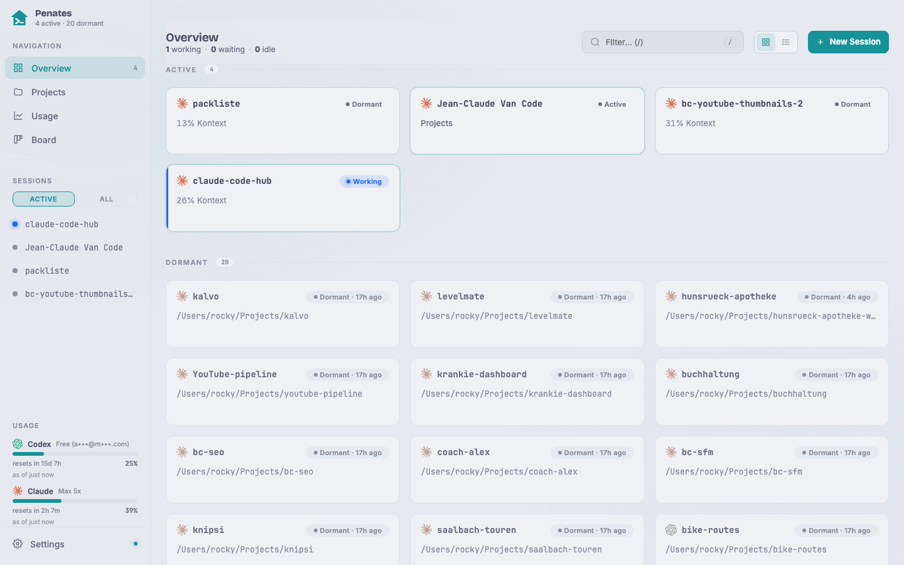

## What it is

A session is a tmux session (prefixed `cc-`) that runs one coding CLI (Claude Code, Codex, Antigravity, or opencode) in a project directory. tmux is the source of truth: the hub keeps no session state of its own, so sessions survive a hub restart and can be adopted even when started outside Penates (e.g. over SSH or via Moshi).

## Why / when to use it

The dashboard is the single place to see and steer every running agent: live activity (working · waiting · idle), context-token use, and the account 5h-limit per card, plus a CLI badge so you know which agent is which. You drive each one from a full browser terminal (colors, copy/paste, scrollback) from your Mac or your phone.

## How to use it

- **Create:** click **New session**, pick a CLI and an approval/sandbox variant, choose a directory, and start. Names are auto-prefixed `cc-`.
- **Attach:** open any card to drop into its terminal over a resilient WebSocket (auto-reconnect with backoff; scrollback replay on fresh connect).
- **Multi-CLI:** the picker offers Claude Code, Codex (`--sandbox` variants), Antigravity (`agy`), and opencode, each with its own login.
- **Rename / adopt / pin / mute:** rename keeps the hook state attached; *adopt* registers a foreign session under its original name; *pin* sorts it to the top; *mute* silences its notifications.
- **Auto-restore:** after a reboot the hub re-spawns the last running `cc-` sessions in their original directory, continuing the CLI conversation (`claude --continue`, `codex resume --last`, `agy --continue`). Opt out per session by stopping it deliberately.

## Limits

Auto-restore is reboot-only and brings back the CLI conversation, not an interrupted task or the in-RAM tmux scrollback. Foreign (non-hub) sessions show activity `unknown` until a hook fires. The `@`-mention helpers (image paste, voice) are Claude-Code-specific.
